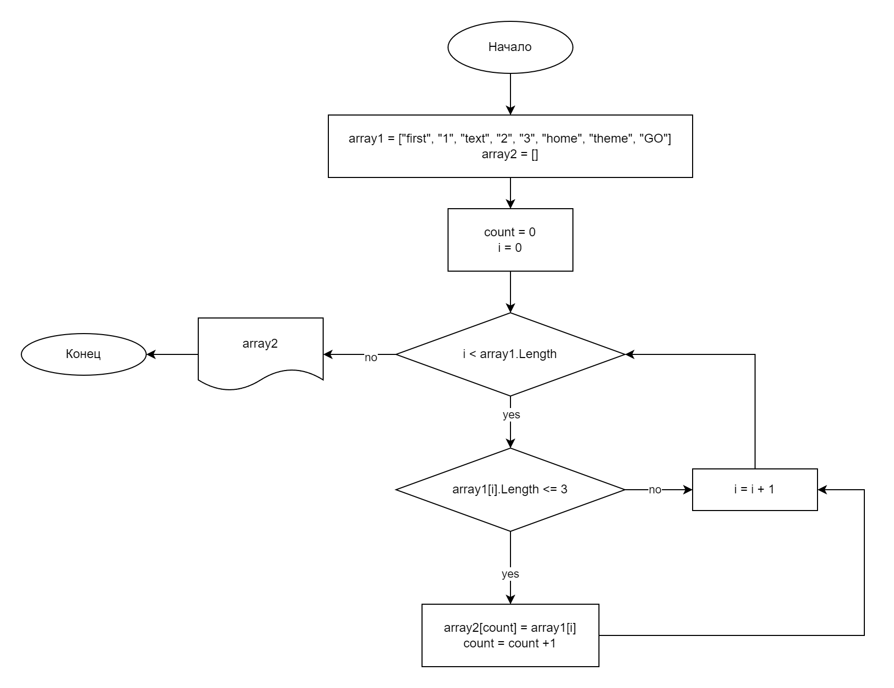

# Контрольная работа #
## Задача: ##
*Написать программу, которая из имеющегося массива строк формирует новый массив из строк, длина которых меньше, либо равна 3 символам. Первоначальный массив можно ввести с клавиатуры, либо задать на старте выполнения алгоритма. При решении не рекомендуется пользоваться коллекциями, лучше обойтись исключительно массивами.*

## Решение: ##
1. Объявляется два массива. Размер второго массива соответствует длине первого.
2. В первом методе **NewArray** с помощью цикла проверяется условие **<=3** поочередно для каждого элемента массива. При соответствии условию элемент записывается во второй массив с данными.
3. Во втором методе **PrintArray** элементы второго массива выводятся в консоль.

